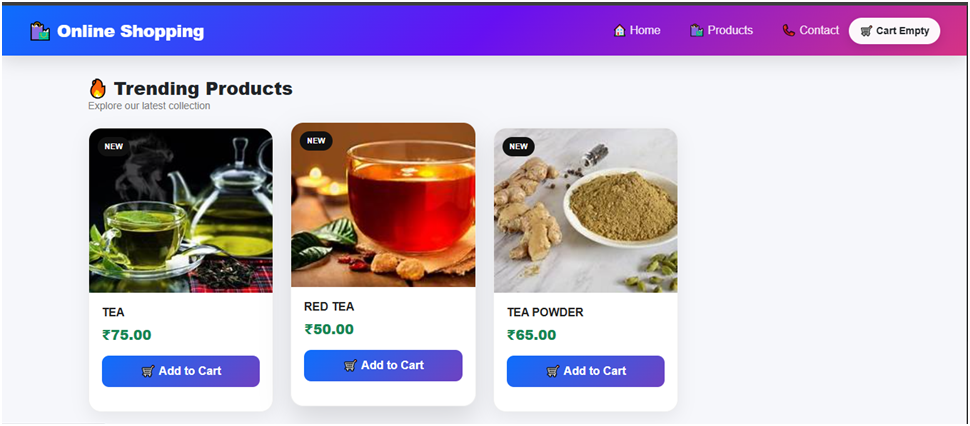
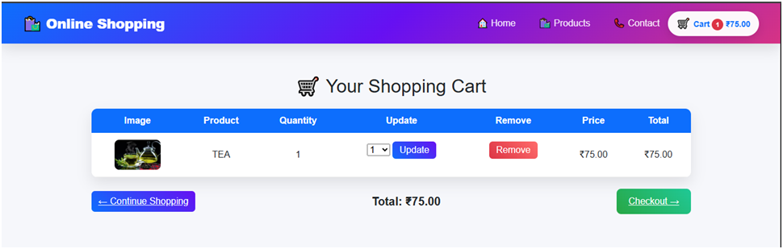

# 🛍️ online shopping

online shopping is a responsive **online shopping  Web Application** developed using **Python, Django, MySQL, HTML, CSS, Bootstrap, and JavaScript**



## 🚀 Features

* 👤 User Registration & Login
* 🔐 User Authentication
* 🛍️ Product Listing & Product Details
* 📂 Category-wise Products
* 🛒 Add to Cart
* ➕ Update / Remove Cart Items
* 💰 Automatic Cart Total Calculation
* 📦 Order Management
* 🖼️ Product Images
* 🛠️ Django Admin Panel
* 📱 Responsive & Modern UI




## 🛠️ Technologies Used

* **Frontend:** HTML5, CSS3, Bootstrap, JavaScript
* **Backend:** Python, Django
* **Database:** MySQL
* **Tools:** VS Code, Git, GitHub

## 📁 Project Structure

```text
AakashKart/
├── manage.py
├── shop/
├── cart/
├── templates/
├── static/
├── media/
├── requirements.txt
├── .gitignore
└── README.md


## ⚙️ Installation


git clone https://github.com/zoyadeveloper1/myshop
cd AakashKart

python -m venv venv
venv\Scripts\activate

pip install -r requirements.txt

python manage.py makemigrations
python manage.py migrate

python manage.py createsuperuser
python manage.py runserver


Open in browser:


http://127.0.0.1:8000/


## 🎯 Project Objective

The main objective of AakashKart is to build a complete **Django-based online shopping platform** where users can browse products, manage their cart, and place orders through a simple and responsive interface.

## 🔮 Future Enhancements

* 💳 Online Payment Gateway
* ❤️ Wishlist
* ⭐ Product Reviews & Ratings
* 🔍 Advanced Search & Filtering
* 📦 Order Tracking
* 📧 Email Notifications
* ☁️ Cloud Deployment

## 👩‍💻 Author

**R. Durga Devi**
Python Full Stack Developer

**Skills:** Python | Django | React.js | MySQL | HTML | CSS | JavaScript | Bootstrap | Git & GitHub
